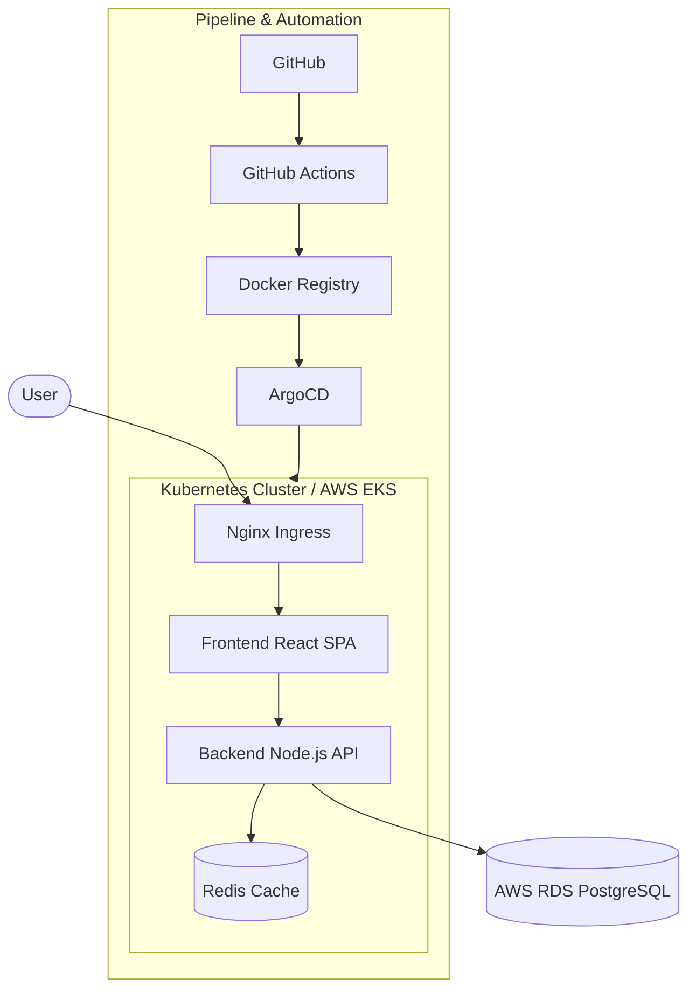

# DevOps Full-Stack Enterprise Architecture


A production-ready, highly-available full-stack application leveraging the complete DevOps toolchain. Designed for massive scale, automated security, and GitOps-driven delivery.

## 🏗 System Architecture



## 🛠 Tech Stack

- **Frontend**: Next.js 15, Tailwind CSS, Framer Motion, Lucide Icons.
- **Backend**: Node.js, Express, JWT, RBAC, Zod validation.
- **Database**: PostgreSQL (Managed via AWS RDS).
- **IaC**: Terraform (VPC, EKS, IAM, Security Groups).
- **Config Management**: Ansible (Server hardening, Tooling installation).
- **Containerization**: Docker (Advanced multi-stage), Docker Compose (Local Dev).
- **Orchestration**: Kubernetes, Helm, ArgoCD (GitOps).
- **CI/CD**: Jenkins Shared Libraries, GitHub Actions.
- **Monitoring**: Prometheus, Grafana, Alertmanager.
- **Security**: SonarQube (SAST), Trivy (Container Scanning), OWASP ZAP (DAST).

## 📁 Project Structure

```text
├── .github/workflows/   # GitHub Actions pipelines
├── ansible/             # Server configuration playbooks
├── backend/             # Node.js API source & Dockerfile
├── docs/                # Detailed tool documentation
├── frontend/            # React/Next.js source & Dockerfile
├── helm/                # Application Helm charts
├── jenkins/             # Jenkinsfile CI/CD logic
├── kubernetes/          # K8s YAML manifests (Infrastucture/App)
├── monitoring/          # Prometheus & Grafana configs
├── scripts/             # Automation & setup utilities
├── terraform/           # AWS Infrastructure as Code
└── docker-compose.yml   # Optimized local development stack
```

## 🚀 Quick Start

### 1. Local Development
```bash
./scripts/setup.sh
docker-compose up --build
```

### 2. Infrastructure Provisioning
```bash
./scripts/terraform-init.sh
# Check terraform/docs.md for next steps
```

### 3. Kubernetes Deployment
```bash
./scripts/k8s-deploy.sh
```

## 🛡️ Security & Observability
- All traffic is encrypted via TLS (Cert-Manager/Let's Encrypt).
- Role-Based Access Control (RBAC) enforced in backend and cluster.
- Automated security gates in CI/CD pipeline.
- 360-degree monitoring with Grafana Dashboards.

## 📖 Component Documentation
Check the `/docs` folder for detailed guides:
- [Docker & Containerization](./docs/docker.md)
- [Kubernetes Architecture](./docs/kubernetes.md)
- [Terraform Infrastructure](./docs/terraform.md)
- [Prometheus Monitoring](./docs/monitoring.md)
- [Jenkins Pipelines](./docs/jenkins.md)

## 👤 Author
Developed as a showcase for modern Enterprise DevOps Architecture.
